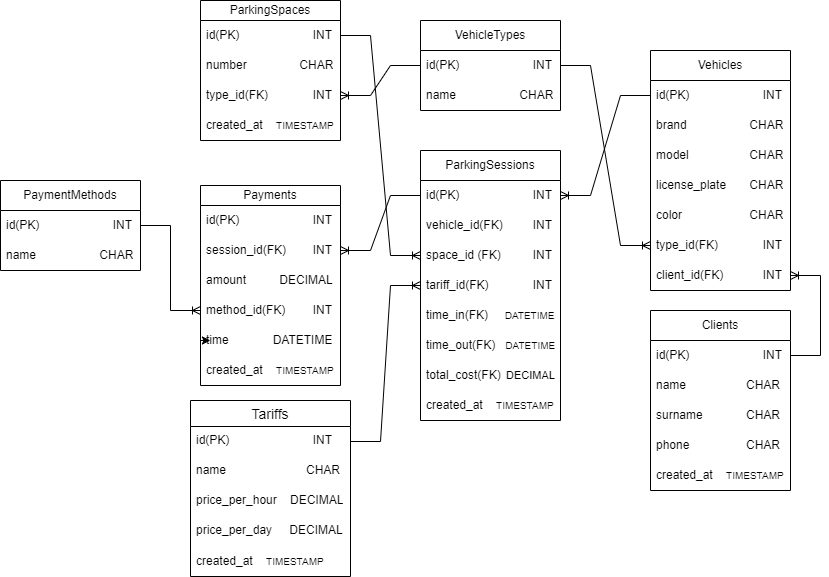

# Проектирование и разработка информационной системы для автостоянки

## Введение
Информационная система (ИС) «Автостоянка» предназначена для автоматизации бизнес-процессов платных парковок и автостоянок. Система позволит вести учет транспортных средств и их владельцев, контролировать въезд и выезд, автоматически рассчитывать стоимость стоянки, управлять парковочными местами и формировать отчетность. Внедрение системы позволит повысить эффективность работы, минимизировать человеческий фактор и улучшить качество обслуживания клиентов

Программа разрабатывается на основе учебного плана кафедры «Информационных систем и технологий» ПГУТИ

## Цель и назначение 

Цель: Создать современную, надежную и масштабируемую информационную систему, повышающую эффективность управления автостоянкой за счет автоматизации ключевых процессов.

Назначение: «Автостоянка» предназначена для использования администраторами и операторами платных автостоянок. Система предоставляет инструменты для учета, контроля, расчета и анализа данных.

## ER-диаграмма базы данных



## Файловая структура проекта
```
course-project-psuti/
├── k8s/ # Kubernetes манифесты
├── migrations/ # Alembic миграции базы данных
├── project/ # Основной код проекта
│ └── app/
│ ├── api/ # API роутеры 
│ │ └── v1/
│ │ ├── clients.py 
│ │ ├── vehicles.py 
│ │ ├── parking.py 
│ │ └── payments.py 
│ ├── modules/ # Бизнес-модули приложения
│ │ ├── clients/ 
│ │ │ ├── schemas.py 
│ │ │ ├── utils.py 
│ │ │ └── views.py 
│ │ ├── vehicles/ 
│ │ ├── parking/ 
│ │ └── payments/ 
│ ├── models/ # SQLAlchemy модели базы данных
│ │ ├── client.py 
│ │ ├── vehicle.py
│ │ │  ......
│ ├── core/ # Конфигурация PostreSQL
│ ├── static/ # Статические файлы
│ ├──templates/ # HTML шаблоны
│ └── main.py # Запуск FastAPI приложения
├── .gitignore 
├── alembic.ini 
├── docker-compose.yml
├── pyproject.toml 
├── README.md 
└── requirements.txt 
```
**Технологический стек разработки**

**Технологический стек разработки**

| Компонент | Технология | Версия | Назначение |
|-----------|------------|--------|------------|
| **Бэкенд** | Python | 3.8+ | Основной язык программирования |
| **Веб-фреймворк** | FastAPI | 0.100+ | Обработка HTTP-запросов и API |
| **ORM** | SQLAlchemy | 2.0+ | Работа с реляционной базой данных |
| **База данных** | PostgreSQL | 13+ | Основное хранилище данных |
| **Миграции** | Alembic | 1.12+ | Управление версиями схемы БД |
| **Контейнеризация** | Docker | 20.0+ | Упаковка приложения в контейнеры |
| **Оркестрация** | Kubernetes | 1.25+ | Управление контейнерами |